# AIRIZZ Website Architecture Documentation

This document provides a comprehensive overview of the technical architecture of the **AIRIZZ** website (airizz.co), which has been structured as a monorepo containing a Next.js frontend and a Node.js/Express backend. Use this guide to understand how files are structured, how pages and components are linked, how data flows through the application, and how to safely extend the site.

---

## 1. System Flowchart

The diagram below details the hierarchy of the application shell, page routing layouts, component links, dynamic data loading paths, and runtime styling/animation libraries:

```mermaid
graph TD
    %% Root Layout Structure
    Layout["Root Layout (frontend/app/layout.tsx)"] --> ScrollProvider["ScrollProvider (Lenis Smooth Scroll)"]
    
    %% Shell Layout
    ScrollProvider --> Navbar["Navbar Component (frontend/components/layout/Navbar.tsx)"]
    ScrollProvider --> MainContent["Page Content (main tag)"]
    ScrollProvider --> Footer["Footer Component (frontend/components/layout/Footer.tsx)"]
    ScrollProvider --> CookieBanner["CookieBanner (frontend/components/layout/CookieBanner.tsx)"]
    ScrollProvider --> CalendlyFloat["CalendlyFloat (frontend/components/layout/CalendlyFloat.tsx)"]

    %% Page Routing & Hierarchy
    subgraph App_Pages ["App Routing (frontend/app/)"]
        MainContent --> Home["Home Page (page.tsx)"]
        MainContent --> About["About Us (about/page.tsx)"]
        MainContent --> Careers["Careers (careers/page.tsx)"]
        MainContent --> Pricing["Pricing (pricing/page.tsx)"]
        MainContent --> Contact["Contact (contact/page.tsx)"]
        MainContent --> Products["Products (products/page.tsx)"]
        MainContent --> EstimatorPage["AI Cost Estimator (estimate/page.tsx)"]
        
        %% Dynamic Slugs
        MainContent --> ServicesIndex["Services Index (services/page.tsx)"]
        ServicesIndex --> ServicePlaybook["Dynamic Playbook (services/[service]/page.tsx)"]
        
        MainContent --> IndustriesIndex["Industries Routing"]
        IndustriesIndex --> IndustryPlaybook["Dynamic Industry (industries/[industry]/page.tsx)"]
        
        MainContent --> BlogIndex["Blog Index (blog/page.tsx)"]
        BlogIndex --> BlogDetail["Dynamic Blog Post (blog/[slug]/page.tsx)"]
        
        MainContent --> CaseIndex["Case Studies Index (case-studies/page.tsx)"]
        CaseIndex --> CaseDetail["Dynamic Case Study (case-studies/[slug]/page.tsx)"]
    end

    %% Data Loading Flow
    subgraph Data_Layer ["Dynamic Content Engine"]
        MDXLoader["Content Loader (frontend/lib/content.ts)"]
        MatterParser["Gray-matter frontmatter parser"]
        BlogFiles["Blog MDX files (frontend/content/blog/*.mdx)"]
        CaseFiles["Case Studies MDX (frontend/content/case-studies/*.mdx)"]
        
        BlogFiles --> MDXLoader
        CaseFiles --> MDXLoader
        MDXLoader --> MatterParser
        MatterParser --> BlogDetail
        MatterParser --> CaseDetail
        MatterParser --> BlogIndex
        MatterParser --> CaseIndex
    end

    %% Backend Services Flow
    subgraph Backend_Services ["Express Backend (backend/)"]
        EstimatorPage -- "POST /api/estimate" --> Express["Express Server (backend/src/index.ts)"]
        Express --> Scorer["Estimator Logic Scorer (backend/src/utils/estimatorLogic.ts)"]
        Express --> GroqService["Groq AI Service (backend/src/services/groqService.ts)"]
        Express --> AppsScriptService["Google Apps Script Client (backend/src/services/googleScriptService.ts)"]
        
        GroqService -- "fetch completions" --> GroqAPI["Groq Llama-3 API"]
        AppsScriptService -- "POST json payload" --> AppsScript["Google Sheets Web App"]
    end

    %% Animation & Styling Dependency
    subgraph Core_Dependencies ["Shared UI & Animation Layer"]
        TailwindCSS["Tailwind CSS v4 (globals.css, theme variables)"]
        FramerMotion["Framer Motion (FadeUp, AnimatePresence)"]
        GSAP["GSAP (CountUp component state triggers)"]
        Formspree["Formspree API (Contact & Careers forms)"]
        
        Home -.-> FramerMotion
        Home -.-> GSAP
        Contact -.-> Formspree
        Careers -.-> Formspree
        
        %% Global Styles application
        Layout -.-> TailwindCSS
    end
```



---

## 2. Monorepo Directory Structure & Key Files

Here is the file hierarchy map of the repository, highlighting the purpose of each directory:

```text
airizz-website/
├── docs/                           # Architectural & user documentation (Root)
│   ├── architecture.md
│   ├── pages_documentation.md
│   └── technology_stack.md
│
├── frontend/                       # Next.js App Router Frontend Application
│   ├── app/                        # Pages & routing configuration
│   │   ├── estimate/               # AI-Powered Project Cost Estimator (/estimate)
│   │   ├── globals.css             # Tailwind CSS v4 rules & themes
│   │   └── ...
│   ├── components/                 # Reusable React UI Components
│   │   ├── animations/             # Animations wrappers (FadeUp, CountUp, etc.)
│   │   ├── layout/                 # Shell modules (Navbar, Footer, CookieBanner)
│   │   └── shared/                 # UI components (CTAButton, etc.)
│   ├── content/                    # Content Catalog (MDX formats)
│   ├── hooks/                      # React custom hooks
│   └── lib/                        # Shared utilities (content, seo, utils)
│
├── backend/                        # Node.js + Express + TypeScript Backend
│   ├── src/
│   │   ├── index.ts                # Server entry point & API route handlers
│   │   ├── services/
│   │   │   ├── googleScriptService.ts # Leads logging client to Google Sheets Apps Script
│   │   │   └── groqService.ts      # Scoping report generator calling Groq API
│   │   └── utils/
│   │       └── estimatorLogic.ts   # Weighted budget scoring logic
│   ├── package.json                # Dependencies configuration
│   ├── tsconfig.json               # TypeScript compiler config
│   └── .env.example                # Template for server keys
│
├── package.json                    # Root package.json managing helper scripts
└── README.md                       # Monorepo setup guide and documentation
```

---

## 3. Core Architecture Concepts

### 3.1 Server Components vs Client Components
To maintain fast load speeds and optimal SEO scoring (Core Web Vitals), we leverage Next.js Server Components (RSC) by default.
- **RSC (Server)**: Default files in `app/` (e.g. `frontend/app/blog/page.tsx`, `frontend/app/case-studies/[slug]/page.tsx`). These read files from the filesystem on the server, prepare structural markdown, and ship pure HTML to the browser.
- **Client Components (`"use client"`)**: Used strictly when browser interaction, state tracking, or animation scripts are needed:
  - Form validations (Contact and Careers pages).
  - Floating widgets (`CalendlyFloat` and `CookieBanner`).
  - Navigational drawers and scroll hooks (`Navbar` scroll listener, filters).
  - Framer Motion animation containers (`FadeUp.tsx`, `ParticleCanvas.tsx`, `CountUp.tsx`).
  - Estimator Wizard (`frontend/app/estimate/page.tsx`) to manage mult-step form states.

### 3.2 Dynamic Data Loading Engine
Instead of utilizing database clients or heavy frameworks like Contentlayer, we built a lightweight data loading utility in [lib/content.ts](file:///Users/devanshsingh/Desktop/Airizz_main/airizz-website/frontend/lib/content.ts):
1. **Raw Source**: MDX files are saved in `frontend/content/blog/` or `frontend/content/case-studies/`.
2. **Parsing**: Reads the file on the server using Node `fs.readFileSync()`.
3. **Gray-Matter**: Extracts frontmatter variables (such as `title`, `date`, `description`, `category`) and passes raw markdown text inside a `content` string.
4. **Rendering**: Dynamic detail pages (e.g., `frontend/app/blog/[slug]/page.tsx`) load this content at compile time (`generateStaticParams` / pre-rendering) and compile standard HTML.

---

## 4. How to Make Changes Safely (Without Breaking Anything)

If you plan to modify or extend the codebase, please follow these guidelines to keep layouts, styles, and builds healthy:

### 4.1 Adding a New Static Page
1. Create a folder under `frontend/app/` matching your route (e.g., `frontend/app/solutions/`).
2. Create a `page.tsx` file inside it.
3. Import the `seo.ts` constructor or export a metadata object for SEO:
   ```typescript
   export const metadata = {
     title: "Solutions | AIRIZZ",
     description: "Custom solutions for enterprises.",
   };
   ```
4. Register the new link in [components/layout/Navbar.tsx](file:///Users/devanshsingh/Desktop/Airizz_main/airizz-website/frontend/components/layout/Navbar.tsx) and [components/layout/Footer.tsx](file:///Users/devanshsingh/Desktop/Airizz_main/airizz-website/frontend/components/layout/Footer.tsx).

### 4.2 Styling & Typography (Tailwind CSS v4)
- **Do not introduce ad-hoc utility colors**. Always use the defined theme variables from [globals.css](file:///Users/devanshsingh/Desktop/Airizz_main/airizz-website/frontend/app/globals.css).
- **Responsive Breakpoints**:
  - The desktop nav is configured to show on `lg` (`1024px` and up) using `hidden lg:flex`.
  - The mobile menu and drawer are configured to display on screen sizes below `lg` using `lg:hidden`.
  - If you adjust any width/flex structures, ensure you check layouts in tablet widths (`768px` to `1024px`) to make sure elements do not clip.

### 4.3 Build & Compilation
- **Webpack Bundler**: Always run the build process utilizing the Webpack compiler parameter:
  ```bash
  npm run build:frontend
  ```
  *(This triggers `next build --webpack` inside `frontend/` to guarantee a clean, memory-safe production output).*
