# AIRIZZ Website Architecture Documentation

This document provides a comprehensive overview of the technical architecture of the **AIRIZZ** website (airizz.co). Use this guide to understand how files are structured, how pages and components are linked, how data flows through the application, and how to safely extend the site without introducing regressions.

---

## 1. System Flowchart

The diagram below details the hierarchy of the application shell, page routing layouts, component links, dynamic data loading paths, and runtime styling/animation libraries:

```mermaid
graph TD
    %% Root Layout Structure
    Layout["Root Layout (app/layout.tsx)"] --> ScrollProvider["ScrollProvider (Lenis Smooth Scroll)"]
    
    %% Shell Layout
    ScrollProvider --> Navbar["Navbar Component (components/layout/Navbar.tsx)"]
    ScrollProvider --> MainContent["Page Content (main tag)"]
    ScrollProvider --> Footer["Footer Component (components/layout/Footer.tsx)"]
    ScrollProvider --> CookieBanner["CookieBanner (components/layout/CookieBanner.tsx)"]
    ScrollProvider --> CalendlyFloat["CalendlyFloat (components/layout/CalendlyFloat.tsx)"]

    %% Page Routing & Hierarchy
    subgraph App_Pages ["App Routing (app/)"]
        MainContent --> Home["Home Page (page.tsx)"]
        MainContent --> About["About Us (about/page.tsx)"]
        MainContent --> Careers["Careers (careers/page.tsx)"]
        MainContent --> Pricing["Pricing (pricing/page.tsx)"]
        MainContent --> Contact["Contact (contact/page.tsx)"]
        MainContent --> Products["Products (products/page.tsx)"]
        
        %% Dynamic Slugs
        MainContent --> ServicesIndex["Services Index (services/page.tsx)"]
        ServicesIndex --> ServicePlaybook["Dynamic Playbook (services/[service]/page.tsx)"]
        
        MainContent --> IndustriesIndex["Industries Routing"]
        IndustriesIndex --> IndustryPlaybook["Dynamic Industry (industries/[industry]/page.tsx)"]
        
        MainContent --> BlogIndex["Blog Index (blog/page.tsx)"]
        BlogIndex --> BlogDetail["Dynamic Blog Post (blog/[slug]/page.tsx)"]
        
        MainContent --> CaseIndex["Case Studies Index (case-studies/page.tsx)"]
        CaseIndex --> CaseDetail["Dynamic Case Study (case-studies/[slug]/page.tsx)"]
    end

    %% Data Loading Flow
    subgraph Data_Layer ["Dynamic Content Engine"]
        MDXLoader["Content Loader (lib/content.ts)"]
        MatterParser["Gray-matter frontmatter parser"]
        BlogFiles["Blog MDX files (content/blog/*.mdx)"]
        CaseFiles["Case Studies MDX (content/case-studies/*.mdx)"]
        
        BlogFiles --> MDXLoader
        CaseFiles --> MDXLoader
        MDXLoader --> MatterParser
        MatterParser --> BlogDetail
        MatterParser --> CaseDetail
        MatterParser --> BlogIndex
        MatterParser --> CaseIndex
    end

    %% Animation & Styling Dependency
    subgraph Core_Dependencies ["Shared UI & Animation Layer"]
        TailwindCSS["Tailwind CSS v4 (globals.css, theme variables)"]
        FramerMotion["Framer Motion (FadeUp, AnimatePresence)"]
        GSAP["GSAP (CountUp component state triggers)"]
        Formspree["Formspree API (Contact & Careers forms)"]
        
        Home -.-> FramerMotion
        Home -.-> GSAP
        Contact -.-> Formspree
        Careers -.-> Formspree
        
        %% Global Styles application
        Layout -.-> TailwindCSS
    end
```



---

## 2. Directory Structure & Key Files

Here is the file hierarchy map of the repository, highlighting the purpose of each directory:

```text
airizz-website/
├── app/                           # Next.js App Router Pages & Config
│   ├── about/                     # About Us Page (/about)
│   ├── blog/                      # Blog index (/blog) & dynamic posts (/blog/[slug])
│   ├── careers/                   # Careers board (/careers) with application drawer
│   ├── case-studies/              # Case Studies list (/case-studies) & dynamic posts
│   ├── contact/                   # Contact us page (/contact) with Calendly & message form
│   ├── industries/                # Dynamic Industry playbook pages (/industries/[industry])
│   ├── pricing/                   # Pricing Plans and FAQs (/pricing)
│   ├── privacy-policy/            # Legal terms for Privacy Policy (/privacy-policy)
│   ├── products/                  # Prop-tech showcase (/products)
│   ├── services/                  # Dynamic Services playbook pages (/services/[service])
│   ├── terms-of-service/          # Legal terms for Terms of Service (/terms-of-service)
│   ├── globals.css                # Tailwind CSS v4 rules & Clash Display CDN imports
│   ├── layout.tsx                 # Root layout (fonts, providers, shell components)
│   ├── page.tsx                   # Main Landing Page (/)
│   └── sitemap.ts                 # Dynamic XML sitemap generator
│
├── components/                    # Reusable React Components
│   ├── animations/                # Animation wrappers (CountUp, FadeUp, ParticleCanvas, Glow)
│   ├── home/                      # Homepage specific modules (Stats, Testimonials, Problems)
│   ├── layout/                    # Global shell elements (Navbar, Footer, CookieBanner, Calendly)
│   │   ├── Navbar.tsx             # Shared desktop navigation and tablet/mobile drawer
│   │   └── Footer.tsx             # Shared bottom links, email, phone, location & socials
│   └── shared/                    # Reusable UI elements (CTAButton, CalendlyInline)
│
├── content/                       # Content Catalog (MDX format)
│   ├── blog/                      # Raw MDX files for blog posts
│   ├── case-studies/              # Raw MDX files for case study files
│   └── data/                      # Local JSON/TS files containing copy schemas (services, FAQs, etc.)
│
├── hooks/                         # React Custom Hooks
│   ├── useScrolled.ts             # Tracks viewport offset to change navbar background
│   └── useCookieConsent.ts        # Tracks cookie banner state storage
│
├── lib/                           # Core utilities
│   ├── content.ts                 # File System MDX reader using gray-matter frontmatter parser
│   ├── seo.ts                     # Layout metadata constructor helper
│   └── utils.ts                   # Tailwind CSS class merging helper (cn)
│
├── public/                        # Static Assets
│   ├── logo.png                   # Corporate Logo
│   ├── og-image.jpg               # Standard social card preview
│   └── robots.txt                 # Search engine crawling rules
```

---

## 3. Core Architecture Concepts

### 3.1 Server Components vs Client Components
To maintain fast load speeds and optimal SEO scoring (Core Web Vitals), we leverage Next.js Server Components (RSC) by default.
- **RSC (Server)**: Default files in `app/` (e.g. `app/blog/page.tsx`, `app/case-studies/[slug]/page.tsx`). These read files from the filesystem on the server, prepare structural markdown, and ship pure HTML to the browser.
- **Client Components (`"use client"`)**: Used strictly when browser interaction, state tracking, or animation scripts are needed:
  - Form validations (Contact and Careers pages).
  - Floating widgets (`CalendlyFloat` and `CookieBanner`).
  - Navigational drawers and scroll hooks (`Navbar` scroll listener, filters).
  - Framer Motion animation containers (`FadeUp.tsx`, `ParticleCanvas.tsx`, `CountUp.tsx`).

### 3.2 Dynamic Data Loading Engine
Instead of utilizing database clients or heavy frameworks like Contentlayer (which fails inside React 19 / Next.js 16 runtimes), we built a lightweight data loading utility in [lib/content.ts](file:///Users/devanshsingh/Desktop/Airizz_main/airizz-website/lib/content.ts):
1. **Raw Source**: MDX files are saved in `content/blog/` or `content/case-studies/`.
2. **Parsing**: `lib/content.ts` reads the file on the server using Node `fs.readFileSync()`.
3. **Gray-Matter**: Extracts the frontmatter variables (such as `title`, `date`, `description`, `category`) and passes the raw markdown text inside a `content` string.
4. **Rendering**: Dynamic detail pages (e.g., `app/blog/[slug]/page.tsx`) load this content at compile time (`generateStaticParams` / pre-rendering) and compile standard HTML.

---

## 4. How to Make Changes Safely (Without Breaking Anything)

If you plan to modify or extend the AIRIZZ codebase, please follow these guidelines to keep your layouts, styles, and builds healthy:

### 4.1 Adding a New Static Page
1. Create a folder under `app/` matching your route (e.g., `app/solutions/`).
2. Create a `page.tsx` file inside it.
3. Import the `seo.ts` constructor or export a metadata object for SEO:
   ```typescript
   export const metadata = {
     title: "Solutions | AIRIZZ",
     description: "Custom solutions for enterprises.",
   };
   ```
4. Register the new link in [components/layout/Navbar.tsx](file:///Users/devanshsingh/Desktop/Airizz_main/airizz-website/components/layout/Navbar.tsx) (both inside the desktop link block and the mobile drawer list) and [components/layout/Footer.tsx](file:///Users/devanshsingh/Desktop/Airizz_main/airizz-website/components/layout/Footer.tsx).

### 4.2 Adding a New Blog Post or Case Study
1. Create a `.mdx` file inside `content/blog/` or `content/case-studies/`.
2. Ensure you provide all required frontmatter properties to prevent TypeScript parsing errors.
   - For **Blog Posts**:
     ```yaml
     ---
     title: "Post Title"
     date: "2026-06-03"
     description: "Brief summary under 160 characters."
     category: "Automation"
     author: "AIRIZZ Team"
     authorRole: "Integrations Specialist"
     authorImage: "/team-avatar.png"
     readTime: "4 min read"
     ---
     ```
   - For **Case Studies**:
     ```yaml
     ---
     title: "Study Title"
     date: "2026-06-03"
     description: "Brief summary."
     client: "Client Name"
     category: "Logistics"
     results:
       - "62% task time reduction"
       - "Zero invoicing errors"
     ---
     ```

### 4.3 Styling & Typography (Tailwind CSS v4)
- **Do not introduce ad-hoc utility colors**. Always use the defined theme variables from [globals.css](file:///Users/devanshsingh/Desktop/Airizz_main/airizz-website/app/globals.css):
  - Theme colors: `bg-background` (deep navy), `bg-dark-card` (lighter navy), `text-brand-cyan`, `text-brand-purple`, `text-zinc-400`/`text-zinc-500` (for descriptions).
- **Responsive Breakpoints**:
  - The desktop nav is configured to show on `lg` (`1024px` and up) using `hidden lg:flex`.
  - The mobile menu and drawer are configured to display on screen sizes below `lg` using `lg:hidden`.
  - If you adjust any width/flex structures, ensure you check the layouts in tablet widths (`768px` to `1024px`) to make sure elements do not clip.

### 4.4 Resolving Hydration Mismatches
- Next.js pre-renders HTML on the server. If a client component attempts to render dynamic browser-only metrics (like `window.innerWidth`, current timezone dates, or `Math.random()`) on the initial render, the browser rendering will mismatch, triggering hydration errors.
- If you must use browser APIs inside a component:
  1. Wrap the value inside a `useEffect` hook so it only executes client-side after mounting:
     ```typescript
     const [isClient, setIsClient] = useState(false);
     useEffect(() => {
       setIsClient(true);
     }, []);
     if (!isClient) return null; // or loading fallback
     ```
  2. If the hydration error is caused by a client-side browser extension adding attributes to the body (like ColorZilla's shortcut listener), use the `suppressHydrationWarning` property on the affected HTML tag.

### 4.5 Build & Compilation
- Under macOS ARM64 (Apple Silicon), the native compiler can occasionally hit memory bounds when compiling with Turbopack.
- **Rule**: Always run the build process utilizing the Webpack compiler parameter:
  ```bash
  npm run build
  ```
  *(This triggers `next build --webpack` as mapped in `package.json` to guarantee a clean, memory-safe production output).*
