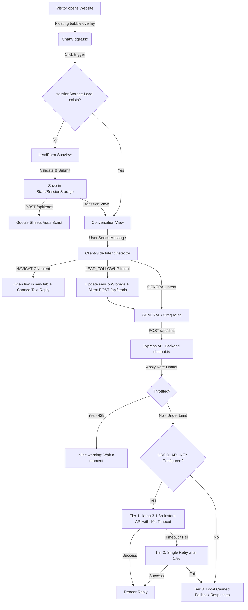

# AIRIZZ Lead Generation Chatbot Agent Architecture

This document details the core concepts, detailed architecture, API configurations, local resilient stacks, and end-to-end operation lifecycles for the custom lead-generating AI Chatbot integrated into the AIRIZZ website.

---

## 1. Core Objectives & Concept
The AIRIZZ chatbot is a layout-level floating overlay designed to engage visitors, capture details of what they are trying to build, qualify leads naturally, and guide qualified prospects toward booking discovery calls.

### Core Principles:
- **API Cost & Limit Optimization**: Leverages client-side intent processing to execute page redirections and navigation triggers locally with **zero API request costs**.
- **Consolidated File Architecture**: The integration is primarily implemented in [ChatWidget.tsx](../frontend/components/layout/ChatWidget.tsx) (frontend) and [chatbot.ts](../backend/src/routes/chatbot.ts) (backend), and wired into the app via the standard Next.js layout and Express router setup.
- **Zero Disruptive Changes**: Sits as an overlay, maintaining 100% compatibility with existing routing, styling (TailwindCSS/CSS themes), and SEO systems.

---

## 2. End-to-End System Architecture



---

## 3. High-Confidence Intent Detector (Client-Side)
To avoid excessive API cost, every user message undergoes a regex and word classification filter in [ChatWidget.tsx](../frontend/components/layout/ChatWidget.tsx) before sending to Groq:

1. **NAVIGATION**: 
   - **Command Verb Check**: Scans for command verbs like `"take me to"`, `"go to"`, `"visit"`, `"open"`, `"show me"`.
   - **Exact Page Match**: Scans for exact single-word matches like `"pricing"`, `"careers"`, `"about"`.
   - **Advantage**: Prevents accidental redirection when key terms are used contextually (e.g. *"Tell me **about** your founders"* stays conversational and goes to Groq, whereas *"go to about"* or just *"about"* redirects the user).
   - **Redirect Map**:
     ```typescript
     const navMap = {
       careers: '/careers',
       about: '/about',
       services: '/services',
       contact: '/contact',
       portfolio: '/case-studies',
       pricing: '/pricing',
       "cost estimation": '/estimate', // Redirects to interactive Cost Estimator page
       blog: '/blog',
       team: '/about#team'
     };
     ```
2. **LEAD_FOLLOWUP**:
   - Detects if the user provides more development detail mid-conversation (e.g., *"I also need Stripe payment and Razorpay integration"*).
   - **Action**: Appends to the session lead's `productBrief` and silently updates the spreadsheet.
3. **GENERAL**:
   - Sends conversation history and lead context to Groq to generate responses.

---

## 4. Backend Resiliency & Groq integration
Located in [chatbot.ts](../backend/src/routes/chatbot.ts), the chat endpoint uses a **3-tier resilience stack**:

- **Tier 1 — Primary API Call**:
  - **Model**: `llama-3.1-8b-instant` (via Groq Cloud API completions).
  - **Params**: temperature `0.5`, max tokens `500`.
  - **Timeout**: `10 seconds` using `AbortController`.
- **Tier 2 — Automatic Retry**:
  - If Tier 1 fails or times out, the backend waits for `1500ms` and retries the Groq API call once.
- **Tier 3 — Local Fallback**:
  - If Groq is completely down or the API key is not configured, the system matches user queries against predefined key-value fallback responses (`services`, `pricing`, `timeline`, `team`, `contact`, `technology stack`, `process`, `mobile apps`, `web apps`, `AI/ML projects`) matching the official AIRIZZ knowledge base rules.
  - Return prefix: `"I'm having a brief technical moment — here's what I know about that: ..."`

---

## 5. Google Sheets Integration Webhook (Apps Script)
To avoid duplications and double-saving when the user updates details mid-chat, you can deploy the following Google Apps Script as a web app. It performs **in-place row updates** if the email already exists in Column C:

```javascript
function doPost(e) {
  try {
    var sheet = SpreadsheetApp.getActiveSpreadsheet().getActiveSheet();
    var data = JSON.parse(e.postData.contents);
    
    // Find if the email already exists in Column C (3rd column)
    var dataRange = sheet.getDataRange();
    var values = dataRange.getValues();
    var foundRowIndex = -1;
    
    for (var i = 1; i < values.length; i++) { // Skip headers row
      if (values[i][2] === data.email) { // Column C is index 2
        foundRowIndex = i + 1; // Get 1-indexed row number
        break;
      }
    }
    
    if (foundRowIndex !== -1) {
      // Update existing row with latest timestamp and enriched product details
      sheet.getRange(foundRowIndex, 9).setValue(data.projectSummary); // Column I is project details
      sheet.getRange(foundRowIndex, 1).setValue(data.timestamp);      // Update Column A
    } else {
      // Append a new row if email doesn't exist
      sheet.appendRow([
        data.timestamp,
        data.name,
        data.email,
        data.company,
        data.phone,
        data.projectType,
        data.budgetExpectation,
        data.generatedEstimate,
        data.projectSummary
      ]);
    }
    
    return ContentService.createTextOutput(JSON.stringify({ status: "success" }))
      .setMimeType(ContentService.MimeType.JSON);
  } catch (err) {
    return ContentService.createTextOutput(JSON.stringify({ status: "error", message: err.message }))
      .setMimeType(ContentService.MimeType.JSON);
  }
}
```

---

## 6. End-to-End Operation Lifecycle Example

### Case: Visitor asks about custom app estimates and provides follow-up specifications.
1. **User lands on Homepage**: A floating teal chat bubble displays in the bottom-right corner.
2. **First Interaction**: Clicking the bubble opens the overlay. Since `sessionStorage` is empty, the `LeadForm` is shown.
3. **Form Submission**:
   - User inputs: Name: *Jane*, Company: *Example Co*, Email: *jane@example.com*, Brief: *A booking platform*.
   - The form is validated client-side and saved to `sessionStorage`.
   - A POST request is sent to `/api/leads` containing user details.
   - The Google Sheets Apps Script receives the POST and appends a row (Row 1).
   - The UI transitions with typing indicators to greet: *"Hi Jane! Great to meet you. So you're working on a booking platform..."*
4. **Redirection Trigger**:
   - User types: *"cost estimation"*
   - The intent detector intercepts this as a high-confidence `NAVIGATION` request matching the estimator page.
   - A `1.0s` thinking delay is simulated on the client side, then a new tab opens `/estimate`, and the bot outputs: *"Opening Estimator for you in a new tab!"*
5. **Silent Lead Enrichment**:
   - User returns to the chat and types: *"It should also have Stripe integration and Razorpay."*
   - The intent detector classifies this as a `LEAD_FOLLOWUP` intent (significant length containing key project keywords).
   - The frontend appends the string to the local `productBrief` and silently POSTs the enriched object back to `/api/leads`.
   - The spreadsheet Apps Script finds the row matching `jane@example.com` and updates Column I in-place (no duplicate rows created).
   - The updated context is sent to the `/api/chat` backend proxy to query Groq.
6. **Conversational Reply**:
   - Groq receives the system prompt with the updated context, understands they want Stripe and Razorpay integrations, and replies using llama-3.1-8b-instant after simulating a natural typing delay.
7. **Rate Limit Warning**:
   - If the user sends more than 20 messages in under a minute, the Express backend responds with status `429`, which the frontend intercepts and displays in-line as: *"Too many messages — please wait a moment."*
